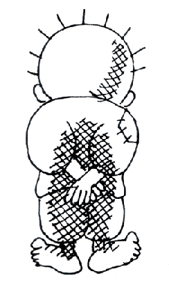

# Hey there!

I am a PhD student at the [ALPACAS research group](https://amir.goharshady.com/alpacas-research-group) at HKUST, where I am happy to be co-supervised by [Amir Goharshady](https://amir.goharshady.com/) and [Jiasi Shen](https://shenjiasi.com/). I am broadly interested in Algorithms, Complexity, Automata, Logic, and Games, as well as their applications in Formal Methods. One theme that I am actively working on is the use of Parameterized Algorithms and Complexity to solve problems in Compiler Optimization and Program Analysis.

My research is funded by the Hong Kong PhD Fellowship Scheme.



